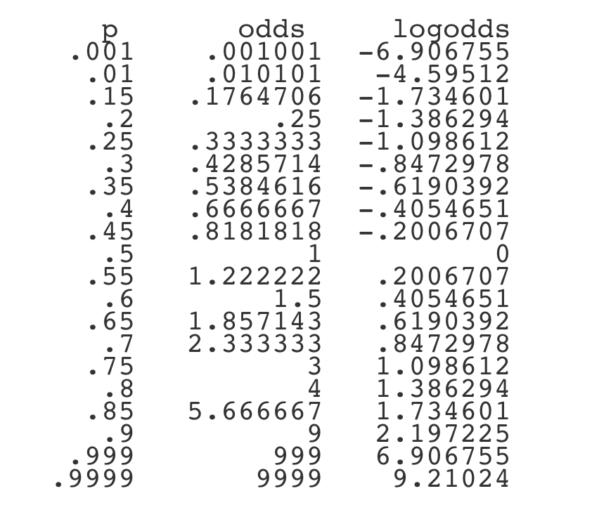
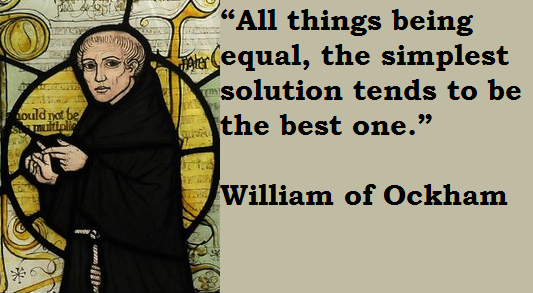

## Welcome {data-background="./img/ucl_artwork/ucl-banner-land-darkblue-rgb.png" data-background-size="70%" data-background-position="top" data-background-opacity="1"}

Probability, Statistics & Modeling II

### Lecture 3

GLM 2

##

### What question do you have?

## 

## Today

- Recap linear regression
- Why the GLM?
- Extended cases: logistic regression
- How good is the model?
- How does one model compare to another?


## Recap linear regression

### Ingredients?

## Recap linear regression

### Core idea?

## Recap linear regression

### Types of effects?

## Recap linear regression

### Residuals?

##

```{r}
x1 = 1:10
y = x1 + rep(c(-1, 1))
df = data.frame(x1, y)
plot(x1, y)
```

##

```{r}
lm_1 = lm(y ~ x1, data=df)
{plot(x1, y, ylim=c(-2, 10))
  abline(lm_1)}
```

##

### Continuation from last week

How to find the "optimal" terms for my model?

## Maybe we can optimise this?

What if you don't know what the 'ideal' model is?

_Especially neat for predictive modelling_

**Back to the shooting data:**

```{r}
load('./data/mass_shootings_detailed.RData')
smsd = smsd[smsd$school_related != 'Killed', ]
smsd = droplevels(smsd)
names(smsd)
```

## Automated variable selection

1. Specify the complete model

```{r}
complete_model = lm(n_fatal ~ n_guns*mental_illness*school_related, data = smsd)
```

2. Specify the null model
```{r}
null_model = lm(n_fatal ~ 1, data = smsd)
```

3. Run model selection ...

3 predictor variables: how many terms in the model?

- 1 intercept
- 3 main effects
- 3 2-way interactions
- 1 3-way interaction

## Model selection

```{r}
summary(complete_model)
```

## Model selection

```{r}
summary(null_model)
```

## Model selection: backward

```{r}
step(complete_model, direction = 'backward')
```

## Model selection: forward


```{r}
step(null_model, direction = 'forward'
     , scope=list(lower=null_model, upper=complete_model))
```

##

## Limitations of linear regression?

```{r}
set.seed(123)
a = rnorm(1000, 30, 10)
b = a + rnorm(1000, 2, 8)
plot(a, b, main = round(cor(a, b), 4))
```

##

```{r}
a_scaled = scale(a)
b_scaled = scale(b)
{plot(a_scaled, b_scaled)
abline(lm(a_scaled ~ b_scaled))}
```

##

```{r}
lm(a_scaled ~ b_scaled - 1)
```

## Limitations of linear regression?

- Correlation != causation
- **Continuous outcome variable**

## Generalising the model

### The Generalised Linear Model

## GLM in general

- framework to deal with different outcome variables
- uses the same "linearity in parameters" idea
- key feature: linking the outcome to the predictor(s)

## The GLM in R

```{r}
my_model_glm = glm(formula = n_fatal ~ n_guns*mental_illness*school_related
               , family = gaussian
               , data = smsd)
summary(my_model_glm)
```

## Compared to `lm`

```{r}
my_model_lm = lm(formula = n_fatal ~ n_guns*mental_illness*school_related
               , data = smsd)
summary(my_model_lm)
```

## GLM vs LM

The LM is a GLM with the Gaussian link function.

- link function 'links' the linear predictor to the mean of the distribution of the outcome variable
- e.g. if outcome variable from normal distribution --> "normal" link function (Gaussian)
- e.g. if outcome variable from poisson distribution --> "Poisson" link (Log)
- e.g. if outcome variable from binomial distributiob --> "Binomial" link (Logit)

## Why bother with this?

Compare:

```{r}
b1 = 1:100 + rnorm(100, 5, 3)
df1 = data.frame(a1 = 1:100, b1)
{plot(b1)
  abline(lm(b1 ~a1, data=df1))}
```

##

```{r}
m1 = lm(b1 ~a1, data=df1)
hist(m1$residuals)
```


## Why bother with this?

Compare:

```{r}
b2 = rep(c(1,0), each=50)
df2 = data.frame(a2 = 1:100, b2)
{plot(b2)
  abline(lm(b2 ~a2, data=df2))}
```

##

```{r}
m2 = lm(b2 ~a2, data=df2)
hist(m2$residuals)
```


##

```{r}
plot(b2)
```


## What to do?

We need a representation of the outcome variable...

- that is linear to the predictor
- i.e. transforms the data to so that Y has a linear relationship to the predictors

_But which function does this?_

## The link function

Answer: for binary outcomes, the **logit** function

- transforms the outcome to a continuous probability
- and uses the log-odds to model a linear relationship between X and Y

## The logit function

- maps `0,1` values to `-Inf : Inf`
- assumes a probability of `P(Y == 1)`
- probability is expressed as the odds
- linearity through the log of the odds

```{r}
prob = 0.40
odds = prob/(1-prob)
odds
log(odds)
```

## Intermezzo: odds 

|      | Smoker | Nonsmoker   |
| ---- | ------ | ------ |
| Dead  | 30    | 20  |
| Alive | 70   | 80  |
|       | 100   | 100  |

```{r}
#Odds of smoker dead: 
(30/100)/(70/100)
# equal to
30/70
```

## Intermezzo: odds 

Odds = event_present/event_not_present

-->

```{r eval=F}
odds = P/(1-P)
```

## Intermezzo: odds 

|      | Smoker | Nonsmoker   |
| ---- | ------ | ------ |
| Dead  | 30    | 20  |
| Alive | 70   | 80  |
|       | 100   | 100  |

Odds of nonsmoker alive?


## Intermezzo: odds 

|      | Smoker | Nonsmoker   |
| ---- | ------ | ------ |
| Dead  | 30    | 20  |
| Alive | 70   | 80  |
|       | 100   | 100  |

```{r}
#Odds of nonsmoker alive: 
80/20
```

## Intermezzo: odds 

|      | Smoker | Nonsmoker   |
| ---- | ------ | ------ |
| Dead  | 30    | 20  |
| Alive | 70   | 80  |
|       | 100   | 100  |

Odds of nonsmoker ~~alive~~ dead?

## Intermezzo: odds 

|      | Smoker | Nonsmoker   |
| ---- | ------ | ------ |
| Dead  | 30    | 20  |
| Alive | 70   | 80  |
|       | 100   | 100  |

Odds of nonsmoker ~~alive~~ dead?

```{r}
20/80
```

```{r}
1/(80/20)
```

## Intermezzo: odds 

|      | Smoker | Nonsmoker   |
| ---- | ------ | ------ |
| Dead  | 30    | 20  |
| Alive | 70   | 80  |
|       | 100   | 100  |


Odds ratio: association between both factors.

```{r}
OR = (30/70)/(20/80)
OR
```


## The logit function

Models the binary outcome through the log odds of the predictors.



Implication: transformation of the coefficients

**Remeber: we model the log of the odds ratio.**

## The logit function

Implication: transformation of the coefficients

**Remeber: we model the log of the odds ratio.**

So we need to 'unlog' the coefficients to get the odds.

##

## Case today: Parole data

Dataset from [Kaggle](https://www.kaggle.com/parole-hearing-data/parole-hearings-in-new-york-state/version/1).

```{r}
load('./data/parole_data.RData')
parole_data
```

## 

Suppose we model the success of parole hearings...

```{r}
parole_success = glm(granted ~ sex
                     , data=parole_data
                     , family = 'binomial')
parole_success
```

##

```{r}
summary(parole_success)
```


## What does this mean?

```{r}
coefficients(parole_success)
```

**What would the lm interpretation be?**

## Coefficient interpretation

Remember what the logit function does?

```{r eval=F}
Y ~ log_odds_ratio(X)
```

... So the coefficient `X` needs to be transformed.

## Coefficient interpretation

Transforming the coefficient:

**log odds** to **probability**

- **log ** --> un-log
    - natural logarithm reverse
    - `e` ---> `exp()` in R
    
    
<!-- ## Coefficient interpretation -->

<!-- Write our own conversion function: -->

<!-- ```{r} -->
<!-- logodds_to_prob = function(x){ -->
<!--   unlogged_odds = exp(x) -->
<!--   probability = unlogged_odds/(1+unlogged_odds) -->
<!--   return(probability) -->
<!-- } -->
<!-- ``` -->

## Coefficient interpretation

Let's use the output and transform:

```{r}
coefficients(parole_success)
```

```{r}
exp(-1.36)
```

## Understanding the odds

```{r}
table(parole_data$granted, parole_data$sex)
```

## Odds by hand

|      | Female | Male   |
| ---- | ------ | ------ |
| 0    | 228    | 10220  |
| 1    | 2493   | 28594  |
|      | 2721   | 38814  |

Odds of male granted:

```{r}
(28594/38814)/(10220/38814)

#Note: equivalent to 28594/10220
```

##

Odds of female granted:

```{r}
2493/228
```


## Odds ratio male to female granted

```{r}
2.7978/10.9342
```

Proof:

```{r}
log(0.2558)
```

```{r}
coefficients(parole_success)
```

## Interpretation

Conversely: Female to male odds ration...

```{r}
10.9342/2.7978
```

  > The odds of being granted parole as a female are 3.90 times the odds of being granted parole as a male.

## Add additional factor?

```{r}
tapply(parole_data$granted, list(parole_data$race), mean)
```

## Extend the model

```{r}
parole_success_2 = glm(granted ~ sex + race
                     , data=parole_data
                     , family = 'binomial')
summary(parole_success_2)
```

## Interpretation

```{r}
coefficients(parole_success_2)
```

**???**

--> Key: odds ratio to reference group

## Interpretation

```{r}
# --> sex: MALE to FEMALE
exp(-1.259)

# --> race: HISPANIC to BLACK
exp(0.096)

# --> race: WHITE to BLACK
exp(0.7613)
```


## Adding more...

```{r}
interaction.plot(parole_data$sex, parole_data$race, parole_data$granted)
```


## Interactions?

```{r}
tapply(parole_data$granted, list(parole_data$sex, parole_data$race), mean)
```

## Extend the model further

```{r}
parole_success_3 = glm(granted ~ sex*race
                     , data=parole_data
                     , family = 'binomial')
parole_success_3
```

## Interpretation

```{r}
coefficients(parole_success_3)
```

Have a look at [this Stackexchange answer](https://stats.stackexchange.com/a/57052).

## Interpretation

```{r}
exp(coefficients(parole_success_3))
```

Odds ratios!

  > For males the OR of BLACK to HISPANIC is 1.23 the OR of females

```{r}
exp(coefficients(parole_success_3))
```

Odds ratios!

  > For males the OR of BLACK to WHITE is 0.97 the OR of females


```{r}
exp(coefficients(parole_success_3))
```

Odds ratios!

  > For males the OR of granted parole is 0.27 the OR of females


```{r}
exp(coefficients(parole_success_3))
```

Odds ratios!

  > For WHITE defendants the OR of granted parole is 2.21 the OR of BLACK defendants


## Connections to machine learning

- Regression the best starting point
- Core difference: explanatory modelling vs predictive modelling
- More care against overfitting in predictive modelling
- Split the data

##

##

### Goodness-of-fit of a model

Assessing how good a model is

## Model fit


## Model fit

**Explained variance:** R-squared [(multiple vs adjusted)](http://blog.minitab.com/blog/adventures-in-statistics-2/multiple-regession-analysis-use-adjusted-r-squared-and-predicted-r-squared-to-include-the-correct-number-of-variables)

```{r}
summary(complete_model)
```


## Model fit

**Mean squared error**

```{r}
mean(complete_model$residuals^2)
```

## Model fit

**Root mean square error**

```{r}
sqrt(mean(complete_model$residuals^2))
```

## Model fit

**Mean absolute error**

```{r}
mean(abs(complete_model$residuals))
```

## Model fit

**Mean percentage error**

```{r}
mean(complete_model$residuals/(complete_model$model$n_fatal+1)*100)
```


## Model fit

**Mean absolute percentage error**

```{r}
mean(abs(complete_model$residuals/(complete_model$model$n_fatal+1))*100)
```


##

##

### Model comparison

When to choose one model over the other?

## Model comparison

Idea: 2 models compete

Requirement: the two models are nested

## Nested models

```{r}
model_1 = lm(n_fatal ~ mental_illness, data = smsd)
model_2 = lm(n_fatal ~ mental_illness+school_related, data = smsd)
model_3 = lm(n_fatal ~ mental_illness*school_related, data = smsd)
```

## Rough model evaluation

```{r}
sqrt(mean(model_1$residuals^2))
sqrt(mean(model_2$residuals^2))
sqrt(mean(model_3$residuals^2))
```

## But you want to be precise...

_Model comparison test_

```{r}
anova(model_1, model_2)
```

##

```{r}
anova(model_2, model_3)
```

##

```{r}
anova(model_1, model_3)
```

## Model comparison



## Model comparison

- only if additional parameters improve the model significantly
- vice versa: you only reject your model if it's significantly worse than a more complicated model

##

## RECAP

- model selection
- logistic regression
- coefficient interpretation
- model selection

## Outlook

**Next week**

- Hypothesis testing beyond t-tests
- GLM as ANOVA

**Homework**

- Advanced regression modelling in R

## END
