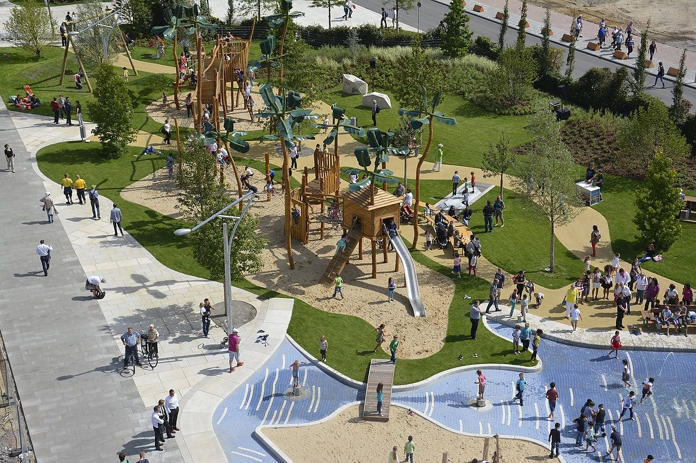

## {data-background="./img/ucl_artwork/ucl-banner-land-darkblue-rgb.png" data-background-size="70%" data-background-position="top" data-background-opacity="1"}

Probability, Statistics & Modeling II

### Lecture 5

Non-paramtric tests & discrete data

##

### What question do you have?

## Today


- What to do if the parametric assumptions violated
- Non-parametric equivalents
- Discrete data (chisquare, loglinear model)

##

### Non-parametric tests

## ~~Non~~ Parametric tests

Parametric assumptions

- Independence of errors
- Homogeneity of variance
- Normality 

## Independence of errors

```{r echo=F}
set.seed(13)
a = rnorm(1000, 10, 10)
b = rnorm(1000, 10, 10)
lm1 = lm(a ~ b)
plot(lm1$residuals, ylab='Residuals', main='Residual plot')
```

## Independence of errors

- errors (estimated through residuals) should be 'randomly' distributed around 0
- ... for all observations
- rule to investigate this: correlation
    - between residuals and predictor variable(s)
    
```{r echo=F}
plot(b, lm1$residuals, main=paste('Correlation coef. r =', cor(b, lm1$residuals)))
```


## Homegeneity of variance

Also called: homoscedasticity

```{r echo=F}
plot(lm1, which = 3)
```

## Homegeneity of variance

Can be tested with:

- Levene's Test `car:leveneTest(...)`
- Breush Pagan Test `lmtest::bptest(...)`
- both have H0 = data is homoscedastic


## Normality

```{r echo=F}
set.seed(1234567)
hist(rnorm(1000000))
```

## Normality

```{r echo=F}
set.seed(1234567)
hist(rpois(1e6, 3))
```

## Normality

Normally met when:

- sample size is considerably large (e.g. n > 50)

Can be tested with:

- Kolmogorov-Smirnov Test
- Shapiro's Test `shapiro.test()`
- both have H0 = data is normally distributed


## 

### What to do if these are violated?


## Violation of parametric assumptions

| Assumption| Test| Potential fix|
|:----------|----------------------:|-------------------:|
|Independence of errors| Resiudal-predictor plot, correlation| Autocorrelation-sensitive methods|
|Homoscedasticity | Levene's Test, plot| [Box-Cox transformation](https://datascienceplus.com/how-to-detect-heteroscedasticity-and-rectify-it/)|
|Normality| K-S test, Shapiro's Test| Transforming data|


## Non-paramtric tests: Correlation

Parametric case:

```{r echo=F}
set.seed(4)
var_a = rnorm(100)
var_b = var_a + rnorm(100, 0.1, 1)
plot(var_a, var_b, main=paste('cor(var_a, var_b) = ', round(cor(var_a, var_b), 2), sep=""))
```


## Non-paramtric tests: Correlation

Non-parametric case

```{r echo=F}
set.seed(4)
iq = round(rnorm(100, 100, 15))
class_rank = sample(c(1:10), 100, replace=T)
plot(iq, class_rank, main="IQ score by class rank", xlab="IQ", ylab="class rank")
```

Problem: class rank not parametric (e.g. not normally distributed)

## Non-paramtric tests: Correlation

**Spearman's correlation test**

Idea:

- rank the data
- run correlation on ranked data

```{r}
cor.test(iq, class_rank, method = 'spearman')
```


## Non-paramtric tests: T-tests

Parametric case: Independent samples t-test

```{r echo=F}
set.seed(24)
males = rnorm(100, 100, 15)
females = rnorm(100, 110, 15)
{plot(density(males), col='blue', xlim=c(20, 160), main="IQ per male (blue) and female (red)", xlab="")
  lines(density(females), col='red')}
```


## Non-paramtric tests: T-tests

Parametric case: Independent samples t-test

```{r}
t.test(males, females)
```

## Non-paramtric tests: T-tests

Non-parametric case: Independent samples t-test

```{r echo=F}
set.seed(24)
males = sample(c(1:10), 100, replace=T)
females = sample(c(1:10), 100, replace=T)
hist(males)
```

Problem: variable "rank" not parametric (e.g. not normally distributed)

## Non-paramtric tests: T-tests

**Wilcoxon Rank Sum Test**

Idea:

- rank the data
- sum the ranks
- use the smallest rank sum as test statistic
- assess the significance of the test-statistic


```{r}
df = data.frame(males, rank(males), females, rank(females))
knitr::kable(df[1:6, ])
```


## Wilcoxon rank sum test


```{r}
wilcox.test(males, females)
```

For the non-parametric "dependent t-test", you'd have to use the 'paired' argument (same is in the `t.test` function).


## Non-paramtric tests: ANOVA

```{r echo=F}
set.seed(241)
north = sample(c(1:90), 100, replace=T)
south = sample(c(1:50), 100, replace=T)
east = sample(c(1:100), 100, replace=T)
west = sample(c(1:80), 100, replace=T)
deprivation = data.frame(deprivation = c(north, east, south, west), area = rep(c('north', 'east', 'south', 'west'), each=100))
boxplot(deprivation$deprivation ~ deprivation$area)
```


##

```{r echo=F}
hist(east, main='Histogram of deprivation percentiles East')
```

## Non-paramtric tests: ANOVA

**The Kruskal-Wallis Test**

- rank the data
- sum the ranks per group
- apply [Kruskal-Wallis formula](https://en.wikipedia.org/wiki/Kruskal%E2%80%93Wallis_one-way_analysis_of_variance#Method) to calculate the test-statistic $H$
- test significance of H

## Non-paramtric tests: ANOVA

```{r}
kruskal.test(deprivation ~ area, data = deprivation)
```


##

### Discrete data

##


## Problem

```{r echo=F}
data1 = array(c(300, 200, 250, 250), dim=c(2,2))
dimnames(data1) = list( c('Hacked', 'Not hacked')
                       , c('No anti-virus software', 'Anti-virus software'))
knitr::kable(data1)
```

- uni-directionality?
- bi-directionality?
- third variable?

**Association test**

## 2 by 2 tables

**Chi-square test**

```{r echo=F}
data1 = array(c(300, 200, 250, 250), dim=c(2,2))
dimnames(data1) = list( c('Hacked', 'Not hacked')
                       , c('No anti-virus software', 'Anti-virus software'))
knitr::kable(addmargins(data1, c(1,2)))
```


## Discrete data

Idea of the Chi-square test:

- Observed values $O$
- Expected values (if there were no association) $E$
- rows: $i$
- columns: $j$

$E_i,_j = (total_i * total_j)/total$


## Expected values

$E_i,_j = (total_i * total_j)/total$

|           | No anti-virus software| Anti-virus software|  Sum|
|:----------|----------------------:|-------------------:|----:|
|Hacked     |                    ?|                 ?|  550|
|Not hacked |                    ?|                 ?|  450|
|Sum        |                    500|                 500| 1000|

Example: cell [hacked, no anti-virus software] --> cell [1,1]

$E_i,_j = (total_i * total_j)/total$

$ = (550 * 500)/1000$

$ = 275$


##

```{r echo=F}
expected_values = chisq.test(data1)$expected
knitr::kable(addmargins(expected_values, c(1,2)), caption = 'Expected values')
```


## Calculating the Chi-square value

$\chi^2 = \sum\frac{(O - E^2)}{E}$

For cell[2,1]:

$cell[2,1] = \frac{(200-225)^2}{225} = \frac{-25^2}{225} = \frac{625}{225} = 2.78$

## Calculating the Chi-square value

- Repeat procedure for all cells
- Sum the values

$\chi^2 = 9.701$

|           | No anti-virus software| Anti-virus software|
|:----------|----------------------:|-------------------:|
|Hacked     |                    300 (275)|                 250 (275)|
|Not hacked |                    200 (225)|                 250 (225)|


- Null-hypothesis: there is no association between the two factors
- Alt. hypothesis: there is a significant association

## The Chi-square test for 2*2 tables

```{r echo=F}
chisq.test(data1, correct = F)
```

## Now what?

> There is a significant association between being hacked (hacked vs not hacked) and the use of anti-virus software (no anti-virus software vs anit-virus software), X^2^(1) = 10.10, _p_ = .001.

But where does this association stem from? What drives it?

## 

```{r echo=F}
knitr::kable(data1)
```

## Standardized residuals

Interpret as:

- the number of standard deviations away from zero
- we know: +/- 2.58 SD = 0.01 and 0.99 percentile

```{r}
knitr::kable(chisq.test(data1, correct = F)$stdres)
```


## Interpretation

|           | No anti-virus software| Anti-virus software|
|:----------|----------------------:|-------------------:|
|Hacked     |               3.18 (O > E)|           -3.18 (O < E)|
|Not hacked |              -3.18 (O < E)|            3.18 (O > E)|

## From 2-by-2 to r-by-c

```{r echo=F}
data2 = array(c(200, 400, 350, 250, 300, 150, 150, 200, 150), dim=c(3,3))
dimnames(data2) = list( c('No access', 'Files stolen', 'Ransomware')
                       , c('Non AV', 'standard AV', 'premium AV'))
knitr::kable(data2)
```

## Extension of the 2 by 2 approach

```{r}
knitr::kable(addmargins(data2, c(1,2)))
```

Same steps:

- for each cell $\frac{(O - E^2)}{E}$
- sum to obtain $\chi^2$
- assess _omnibus_ significance
- follow-up interpretation


## (O - E)^2/E

```{r echo=F}
O = chisq.test(data2, correct = F)$observed
E = chisq.test(data2, correct = F)$expected
knitr::kable(round((O-E)^2/E, 2))
```


## Extension of the 2 by 2 approach

```{r echo=F}
chisq.test(data2, correct = F)
```


Follow-up tests for the interpretation.

--> What drives the sign. association?


## Intepreting the r-by-c extension

```{r}
knitr::kable(round(chisq.test(data2, correct = F)$stdres, 2))
```

Remember: interpretation like z-scores

- > +/- 1.96 --> sign. at p < .05
- > +/- 2.58 --> sign. at p < .05

##

|             | Non AV| standard AV| premium AV|
|:------------|------:|-----------:|----------:|
|No access    |  (O < E)|        (O > E)|       (O == E)|
|Files stolen |   (O == E)|        (O == E)|      (O == E)|
|Ransomware   |   (O > E)|       (O < E)|      (O == E)|

## Interpretation

> The significant association between ... was driven by four significant deviations between the observed and expected values. 

- Hackers failed to get access to significantly fewer computers when there was no anti-virus than expected (z = -6.30).
- Hackers inserted ransomware on computers without anti-virus more often than expected (z = 5.94).
- Hackers got access to computers with standard anti-virus software more often than expected (z = 5.61).
- Hackers inserted ransomware on computers with standard anti-virus less often than expected (z = -6.18).

## Discrete data

### Extension to multi-level models

## X by Y by Z cases

- 2-dimensional arrays
    - 2-by-2 tables
    - r-by-c tables
- multidimensional arrays
    - **X**-by-**Y**-by-**Z**


##



## X by Y by Z arrays

```{r echo=F}
data3 = array(c(911, 44, 538, 456, 3, 2, 43, 279), dim=c(2,2,2))
dimnames(data3) = list('vandalised' = c('yes', 'no')
                       , 'natural surveillance' = c('yes', 'no')
                       , 'area' = c('urban', 'suburb')
                       )
ftable(data3, row.vars = c("area","natural surveillance"))
```

- 3 factors
    - vandalised: yes vs no
    - natural surveillance: yes vs no
    - area: urban vs rural

Simple extension of the r*c calculation?

## Multilevel discrete data

```{r echo=F}
prop.table(data3, margin = c(1,3))
```

## Idea of multilevel discrete modelling

If the data were independent...

then the expected count = joint prob. * n, where

joint prob. = product of the marginal probabilities

$\mu_i,_j = n * marginal_i * marginal_j$


```{r echo=F}
knitr::kable(addmargins(prop.table(data1), c(1,2)), caption = 'Probability data')
```


##

```{r echo=F}
knitr::kable(addmargins(prop.table(data1), c(1,2)), caption = 'Probability data')
```

$cell[1,2] = 0.50*0.55*1000 = 275$

$cell[2,2] = 0.50*0.45*1000 = 225$

## Towards a linear model

**Log transformation**

$\mu_i,_j = n * marginal_i * marginal_j$

==

$log(\mu_i,_j) = log(n) + log(marginal_i) + log(marginal_j)$

Hence: "loglinear" model

## The Log-Linear Model

- GLM with link function for count data
- count data aptly modelled as a Poisson distrubuted variable

## The poisson distribution

```{r echo=F}
pois_random = rpois(1000000, 3)
hist(pois_random)
```

## The loglinear model

```{r echo=F}
(data3_ = as.data.frame(as.table(data3)))
```

```{r}
indep_model = glm(formula = Freq ~ vandalised + natural.surveillance + area
               , data = data3_
               , family = poisson)
```


## The loglinear model

```{r echo=F}
summary(indep_model)
```

## Interpretation

1. Look at the Residual deviance
    - Higher deviance = poorer model fit
    - We can test the H0 of model adequacy
    
```{r}
pchisq(1286, 4, lower.tail = F)
```

Reject H0 that the model is a good representation.

## Interpretation

2. Look at the fitted values

```{r}
knitr::kable(cbind(indep_model$data, round(fitted(indep_model), 2)))
```

## Interpretation

3. Look at the anit-logged coefficients

Coefficient for "vandalised=no"

```{r}
exp(-0.64931)
```

Odds of a playground being vandalised are 0.52:1, regardless of whether there was natural surveillance and regardless of the area.

## The full model

Also called: the saturated model

```{r}
full_model = glm(formula = Freq ~ vandalised * natural.surveillance * area
               , data = data3_
               , family = poisson)
```

What do you expect?

## The full model

```{r}
knitr::kable(cbind(full_model$data, round(fitted(full_model), 2)))
```


## Loglinear model strategy

- Find a model less complex than the full model
- ... where you cannot reject the H0 of model adequacy


## Model selection

```{r}
step(full_model)
```

## "Best" model

```{r echo=F}
best_model = glm(formula = Freq ~ vandalised + natural.surveillance + area + 
    vandalised:natural.surveillance + vandalised:area + natural.surveillance:area, 
    family = poisson, data = data3_)
```

```{r}
summary(best_model)
```

## "Best" model

Can we reject the H0 of model adequacy?

```{r}
pchisq(0.37, 1, lower.tail = F)
```

No!

## Fitted values of the "best" model

```{r echo=F}
knitr::kable(cbind(best_model$data, round(fitted(best_model), 2)))
```


## Interpreting the coefficients

```{r}
coefficients(best_model)
```

## Interpreting the coefficients

```{r eval=F}
vandalisedno:areasuburb
2.0545341
```


```{r}
exp(2.055)
```

Exponentiated interaction ==> OR

> Playgrounds that are in the suburb have estimated odds of not being vandalised that is 7.81 times the estimated odds for playgrounds that are in urban areas. This is independent of "natural surveillance".

##


- Log-linear models work in higher dimensions
- Allow you to model count data of 2+ dimensions

Follow the steps [here](https://data.library.virginia.edu/an-introduction-to-loglinear-models/) (https://data.library.virginia.edu/an-introduction-to-loglinear-models/)


##

## RECAP

- 
- 
- 

## Outlook

**Next week:** Reading week

Week 6: Open Science (lecture + tutorial)

## END
