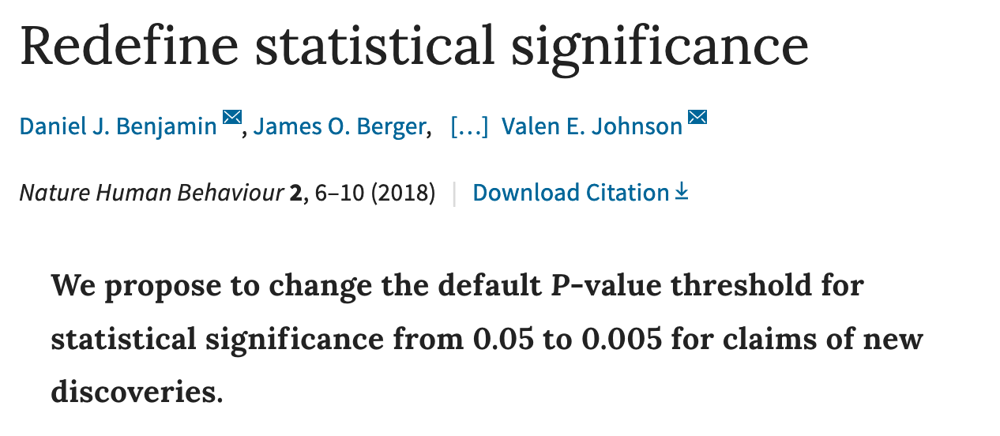
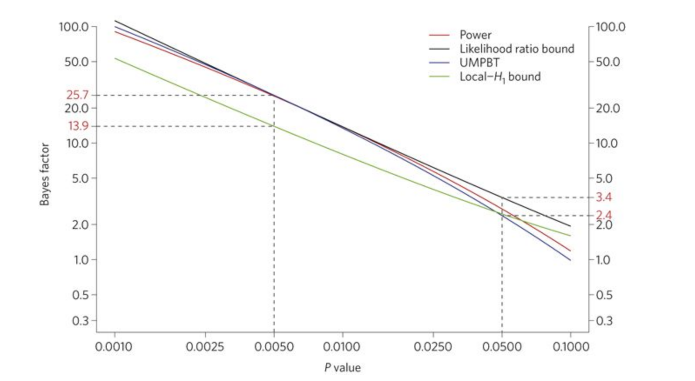
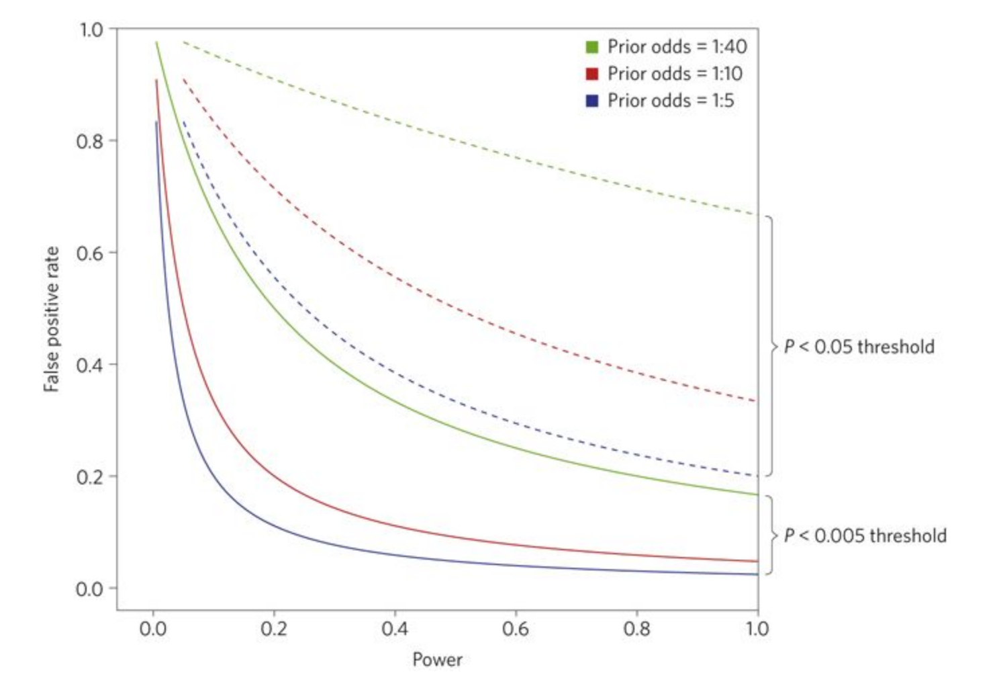
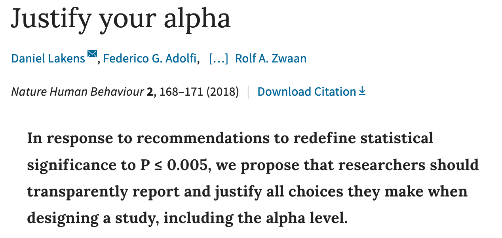
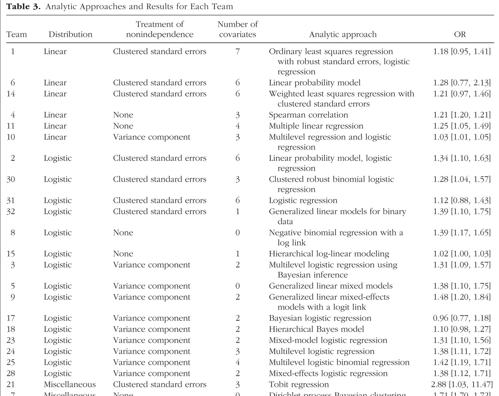
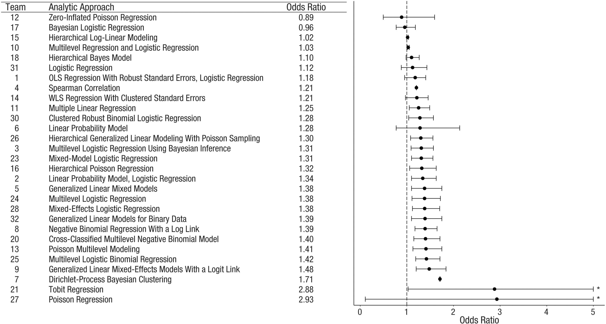

## {data-background="./img/ucl_artwork/ucl-banner-land-darkblue-rgb.png" data-background-size="70%" data-background-position="top" data-background-opacity="1"}

Probability, Statistics & Modeling II

### Lecture 7

Statistical reporting 2 + assessment details

##

### Which question do you have?

## Today

- recap week 1-5
- statistical reporting
- assessment details

## Week 1

- marginal probability
- conditional probability
- Bayes' Rule
- Simpson's paradox

## Week 2

- modelling data
- regression idea
- regression effects

## Week 3

- GLM idea
- logistic regression
- model comparison

## Week 4

- GLM for t-tests
- GLM for ANOVAs
- Relationship between t-test, ANOVA, lm

## Week 5

- non-paramtric tests
- esp. ranking methods
- discrete data
- R by C (ChiSquare)
- X by Y by Z (loglinear)

##

### Statistical reporting

## A tricky time

- Reproducibility crisis (2015)
- Statistics crisis (2016)

## A tricky time

- QRPs widespread
- Some remedies in place
    - preregistration
    - data sharing

## A tricky time

Problems:

- preregistration a long way from the norm
- data sharing is often a taboo

So what can we do without relying on (old) researchers improving their research practices?

## Ways forward

- get the journals on board
- get the funding bodies on board
- tackle the NHST problem

##

### My first "science" surprise

## 

<small>New York Times [article](https://www.nytimes.com/2013/04/28/magazine/diederik-stapels-audacious-academic-fraud.html)</small>

##

<small>[source](http://www.sciencemag.org/news/2016/07/no-tenure-german-social-psychologist-accused-data-manipulation), see also: Retraction Watch [article](https://retractionwatch.com/2017/12/12/psychologist-fire-leaves-university-start-private-practice/)</small>

## The NHST problem

Null hypothesis significance testing highly debated

- issue of "researcher's degrees of freedom"
- analytical techniques
- exclusions
- no. of variables
- ...

**Leads to high prevalence of QRPs**

## Open Science to the rescue?

Remember:

- preregistration not common
- replication not common
- data sharing not common

## Hypothetical scenario

Even if these practices become the norm ...

... we're still stuck with arbitrary p-value thresholds!

##

And anyway:

How are we supposed to report anything now?

## 3 approaches to the p-value issue

1. Apply a new common threshold
2. Always justify your threshold
3. A completely different statistics framework

## A new alpha threshold

<small>[Benjamin et al., 2018](https://www.nature.com/articles/s41562-017-0189-z#Equ1)</small>

## A new alpha threshold

> However, we believe that a leading cause of non-reproducibility has not yet been adequately addressed: statistical standards of evidence for claiming new discoveries in many fields of science are simply too low.

<small>[Benjamin et al., 2018](https://www.nature.com/articles/s41562-017-0189-z#Equ1)</small>

## A new alpha threshold

<small>[Benjamin et al., 2018](https://www.nature.com/articles/s41562-017-0189-z#Equ1)</small>

## A new alpha threshold

<small>[Benjamin et al., 2018](https://www.nature.com/articles/s41562-017-0189-z#Equ1)</small>

## A new alpha threshold

> For research communities that continue to rely on null hypothesis significance testing, reducing the P value threshold for claims of new discoveries to 0.005 is an actionable step that will immediately improve reproducibility.

<small>[Benjamin et al., 2018](https://www.nature.com/articles/s41562-017-0189-z#Equ1)</small>

## Justify your alpha

## Justify your alpha

- "Weak justifications for the α = .005 threshold"
- "How a threshold of p ≤.005 might harm scientific practice"
- "No one alpha to rule them all"

## Justify your alpha

> We call for a broader mandate beyond p-value thresholds whereby all justifications of key choices in research design and statistical practice are transparently evaluated, fully accessible, and preregistered whenever feasible.

<small>[Lakens et al., 2018](https://www.nature.com/articles/s41562-018-0311-x)</small>

## Morale of the story

- single studies overrated
- challenge of single summary statistic remains
- more meaningful
    - replications
    - "many labs" projects
    - RRRs
    - "many analysts" projects
    
## About many analyst projects...

[Silberzahn et al. (2018)](https://journals.sagepub.com/doi/10.1177/2515245917747646):

> "The primary research question tested [...] was whether soccer players with dark skin tone are more likely than those with light skin tone to receive red cards from referees"

- 146,028 dyads of players and referees

## Many analysts

- 29 teams, 61 researchers
- Whole range of academic experience

What do you think?

<small>Give it a try: [https://osf.io/gvm2z/](https://osf.io/gvm2z/)</small>

## Many analysts

- 20 teams found sign. positive relationship
- 9 teams found no relationship

- 29 different analyses
- 21 unique combinations of covariates (e.g. position, country, ...)

## Many analysts

## Many analysts

## 

> "The best defense against subjectivity in science is to expose it."

## A completely different statistics framework

Next week

## For you?

> "The best defense against subjectivity in science is to expose it."

Make yourself and the findings the least vulnerable.

##

##

### The Applied Analysis Project

## General info

- 50% of final grade
- preregistration + independent analysis
- demonstrate your understanding of statistical techniques
- conduct analyes in R

## Details

- we provide a dataset
- your task is to act like an analyst
- answer 5 specific questions
- plus 1 question of your own

## Dataset details

- data on offenders charged with gang-related crimes
- variable codebook [online](https://github.com/ben-aaron188/ucl_psm2_20182019/blob/master/assessment/dataset_details.pdf) and on Moodle

## Dataset release

- Phase 1: pseudo-dataset
    - identical in structure
    - different in values and length
    - serves as input for your preregistration
    - dataset available **now** on Moodle
- Phase 2: full release
    - individualised for each student
    - released via email on 30 March 2019
    

## Preregistration

- Word limit: 300 words 
- detail the hypotheses
    - for the 5 given questions
    - plus for your own question
- specify all exclusions, transformations, selection criteria, etc.
- use the template online on Moodle (based on the OSF template)
- deadline for preregistration: **29 March 2019**
    - submission via TII on Moodle

## Full analysis

- datasets released on **30 March 2019**
- base your analysis on the preregistration
- specify and justify all deviations from the prereg.

## Full analysis report

- no introduction section
- Advised structure:
    - hypotheses
    - method
    - data
    - analytical plan
    - results
    - discussion
    
## Full analysis report

- Word limit: 1,500 words
- Submit as anonymised PDF on TII on Moodle
- Additionally: submit your code supplement
    - R Notebook
    - fully reproducible code
    - submit as an anonymised html on Moodle
- deadline: **16 April 2019**

## Feedback session

- 1-on-1 feedback on 26 March
- 10 min slot for each student
- Template for feedback submission [online](https://github.com/ben-aaron188/ucl_psm2_20182019/blob/master/assessment/feedback_submission_psm2.pdf) and on Moodle

## All dates/deadlines

- dataset release 1: _now_
- deadline feedback submission tenplate: _22 March_ on TII
- deadline preregistration: _29 March_ on TII
- dataset release 2: _30 March_
- deadline final report + code: _16 April_

##

### Questions about the assessment?

##

## Outlook

**Next week:** Bayesian hypothesis testing

Homework: Revise week 1-5

## END
